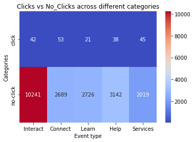

# Hypothesis testing: Chi-Square Test within the Montana Library case study

The Library of Montana State University has a website that students use to find books and articles. 

Right below the library's picture, there's a search bar and three big buttons named "Find", "Request", and "Interact". They all lead to important stuff the library offers. But, funny enough, not many people click on the "Interact" button, even though it sounds like it's for interacting.

Following user interviews and team brainstorming, the website group decided to test four new names for the "Interact" button:

1. Connect
2. Learn
3. Help
4. Services

They chose these metrics to track:

* Click-through rate (CTR) on the homepage: This is calculated by dividing the number of clicks on the button by the total number of visits to the page. It shows how well the category title catches users' attention at first glance.
* Drop-off rate for category pages: This shows the percentage of visitors who leave the site from a specific category page (like Interact, Connect, Learn, etc.) without clicking on any more pages. It tells us if the category page is giving users what they expect. A lower drop-off rate is better because it means users are engaged and finding what they need.
* Homepage-return rate for category pages: This measures how often people who go to specific category pages from the homepage end up going back to the homepage. Like the drop-off rate, this helps us understand if users are getting what they need from these pages. If they often go back to the homepage, they might not be finding the right info on the category pages. We want this rate to be low, showing that users find what they need without having to go back.
For a new version to be seen as better, it must have at least a 30% increase in click-through rate compared to the original "Interact" button.

## Data Source

The A/B test took place between May 29, 2013, and June 18, 2013. The initial dataset contains 5 tables with each test metrics. 

## Objective 

The goal of this project is to form a hypothesis, based on our data from the A/B and to create a Chi-Square Test within the Montana Library case study. 

## Project's folder structure

* /screenshoots: contains 5 different screenshoots of websites' heatmap.
* /data: contains the original tables with the library A/B test
* /plots: project's plots.

## Plots 

A heatmap with a different categories of clicks and no_clicks. 

## Findings

* Our Null Hypothesis was rejected! This means that at least one of our five website versions was significantly better or worst in performance, compared to the other four.
* The two versions that generated the most clicks are "Connect" with "Services". An additional Pos Hoc Tests could be performed to declare the clear winner. 